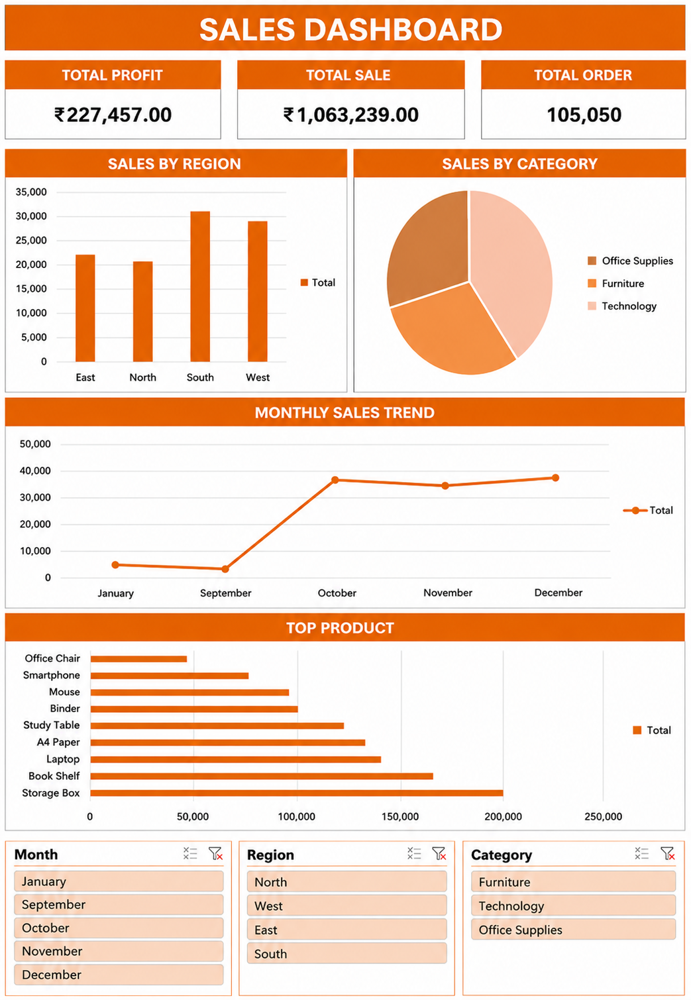

# 📊 Excel Sales Dashboard

## 📌 Project Overview

This project is an interactive Sales Dashboard built using Microsoft Excel. It helps analyze sales performance using Pivot Tables, Pivot Charts, KPI cards, and slicers.

---

## 🚀 Features

- 💰 Total Sales KPI
- 📈 Total Profit KPI
- 📦 Total Orders KPI
- 🌍 Sales by Region
- 🥧 Sales by Category
- 📅 Monthly Sales Trend
- 🏆 Top Products Analysis
- 🎛 Interactive Dashboard with Slicers

---

## 🛠️ Tools Used

- Microsoft Excel
- Pivot Tables
- Pivot Charts
- Slicers
- Dashboard Design

---

## 📷 Dashboard Preview

---

## 📊 Business Insights

- South region generated the highest sales.
- Office Supplies had the highest sales.
- Monthly sales trends were analyzed.
- Top-selling products were identified.

---

## 📂 Project Files

- Excel_Sales_Dashboard.xlsx
- Dataset.xlsx
- Dashboard.png

---

## 👨‍💻 Author

**Rudra Jha**

- 📧 Email: rudrajha377@gmail.com
- 💼 LinkedIn: https://www.linkedin.com/in/rudra-jha-3b82783b1
- 💻 GitHub: https://github.com/rudrajhadatascience-lgtm
